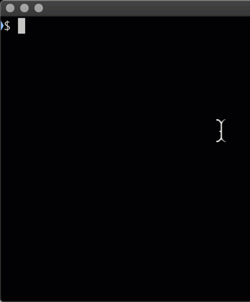

# /dotfiles/todo

a most minimal todo list in the shell

 

## what
some tiny bash aliases for [`recutils`](https://www.gnu.org/software/recutils/) to list/create/delete todo items stored in a local text file.

## install

- install `recutils`
  - Linux: `apt-get install recutils` / `yum install recutils`
  - Mac: `brew install recutils`
- run

```
mkdir -p "$HOME/dotfiles/todo"
git clone https://github.com/christian-korneck/tinytodo.git "$HOME/dotfiles/todo"
echo 'source "$HOME/dotfiles/todo/todo.bashrc"' >> "$HOME/.bash_profile"
source "$HOME/dotfiles/todo/todo.bashrc"
bootstraptodo
```

   ## usage

   - list todos: `lstodos`
   - create new todo: `mktodo 'some text'`
   - delete todo: `rmtodo <id>`
   - create empty todolist file if it doesn't exist (`$HOME/todo.rec`): `bootstraptodo`

  
